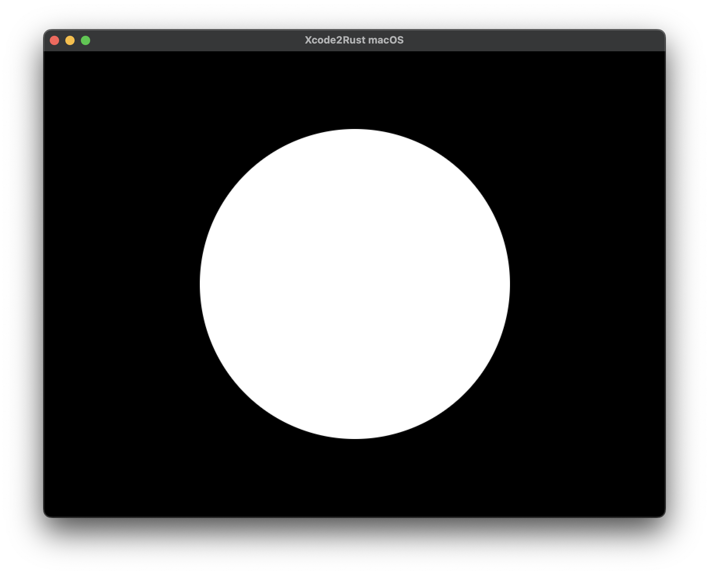

Xcode2Rust makes 2D apps and games written in Rust accessible and deployable in Xcode.

Xcode2Rust is currently under development and functionality is not yet complete.

It opens a Metal based window or screen on macOS, iOS or tvOS (using Xcode) and passes the content of the BGRA8 surface texture to a Rust library for drawing. Xcode2Rust also passes user events and gestures to the Rust library.

Xcode2Rust has similar functionality as the [pixels](https://github.com/parasyte/pixels) crate which I use heavily for my applications (like [Eldiron](https://github.com/markusmoenig/Eldiron)). You can prototype your app in ```pixels``` and once you want to deploy it to the Apple AppStore you can do that via Xcode2Rust with no headache. Window setup, deployment and AppStore settings are a breeze because you use Xcode directly for upload.

## The Rust API

Xcode2Rust has a minimal Rust API, located in the *rustapi* folder of this repository. The current API looks like this:

```rust
#[no_mangle]
/// Draw into the pixel buffer
pub extern "C" fn rust_draw(pixels: *mut u8, width: u32, height: u32) {
}

#[no_mangle]
/// Mouse down or touch down event
pub extern "C" fn rust_mouse_down(x: f32, y: f32) -> bool {
}

#[no_mangle]
/// Mouse dragged or touch dragged event
pub extern "C" fn rust_mouse_dragged(x: f32, y: f32) -> bool {
}

#[no_mangle]
/// Mouse up or touch up event
pub extern "C" fn rust_mouse_up(x: f32, y: f32) -> bool {
}
```

The example library in the the ```rustapi``` folder defines a global DISC class which draws a white circle (multitthreaded via rayon). You can drag the circle with the mouse.



Change the example library to fit your need, compile the library and copy the ```target/release/librustapi.a``` file into ```rustapi/libs```.

Thats it, after this re-compile the Xcode project and your app or game will start inside Xcode.

## Goals

* Provide all user events and gestures to the Rust API (mouse and keyboard events, gestures).
* Although the overall goal for Xcode2Rust is to draw via the CPU, some 2D Metal based hardware accelerated blit operations (for example for tiles and sprites) should be possible.

## Non-Goals

* Hardware accelerated 3D operations.
